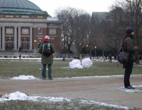

### A. Semantic Segmentation

 

In this problem, you will build your own semantic segmentation model on the
Stanford Background Dataset ([1](#references)). This task comprises of classifying
image pixels into the following 9 categories: sky, tree, road, grass, water,
building, mountain, foreground, misc. We will use the mean average precision
(on the soft output) and mean intersection over union (of the hard output) to
measure performance. We provide code for computing these metrics. 

#### Data
We have `571` images for training, `71` images for validation and `70` images
for testing. Each image is `288×224`. We provide a basic data loader that you
can build upon. Data can be downloaded from
[here](http://saurabhg.web.illinois.edu/teaching/ece598sg/fa2020/mps/mp1/sbd.tgz).
Download the file into the `data` folder, and untar it to obtain a folder
called `sbd`. It should have sub-folders `train`, `val` and `test` containing
images and ground truth labels.

#### Starter Code
We also provide a basic model (that trains a linear classifier on top of the
pixel value at each location), and also a training loop that shows how to use
pytorch for setting up training and validation.

#### What you need to do
1. **Develop your model [15 pts]**: 
Design models for solving this task. You should experiment with different
architectures, regularization, loss functions, data normalization and
augmentation, etc. You can look at the following (or other) papers for
inspiration ([2,3](#references)). In your report, carefully document and report
the major things you try, by noting the key architectural details, design
rationale, and the impact on training plots and validation metrics. You should
also include the relevant training plots and validation metrics.  For
reference, our very basic first implementation is able to do 1 training epoch
in under 2 seconds, and achieves a mAP of 0.56 and a mIoU of 0.38 in under 20
minutes of training.  At the very least your implementation should achieve as
much accuracy on the validation set, but you may be able to do better with more
training, and trying out alternate architectures. Also report the performance
of your best model on the test set.
2.  **Build on top of ImageNet pre-trained Model [15 pts]**: Your next task is
to build on top of a ResNet 18 ([4](#references)) model that has been
pre-trained on the ImageNet dataset ([5](#references)) (via
`models.resnet18(pretrained=True)`).  These models are trained to predict the
1000 ImageNet object classes. To use this model for semantic segmentation, you
will have to remove the classifier and global average pooling layers, and stack
on additional layers for semantic segmentation. Once again, refer to papers
pointed out above for inspiration for how you can build on top of such
pre-existing models. For this part, please keep the part of the model derived
from the ImageNet pre-trained model fixed (you will have to figure out how to
do so in PyTorch).  Again, as above, carefully document the design choices you
make in your report.  For reference, our very basic first implementation is
able to do 1 training epoch in 3.5s, and achieves a mAP of 0.59 and a mIoU of
0.43 in under 20 minutes of training. At the very least your implementation
should achieve as much accuracy on the validation set, but you may be able to
do better with more training, and trying out alternate architectural choices.
Also report the performance of your best model on the test set.
3. **Further train the ResNet trunk [0 pts]**: If you are curious, you can also
train the ResNet-18 trunk (that you kept fixed above) further. 

#### References
1. Stephen Gould, Richard Fulton, and Daphne Koller. Decomposing a scene into
geometric and semantically consistent regions. In ICCV 2009.
2. Olaf Ronneberger, Philipp Fischer, and Thomas Brox. U-net: Convolutional
networks for biomedical image segmentation. In MICCAI 2015.
3. Jonathan Long, Evan Shelhamer, and Trevor Darrell. Fully convolutional
networks for semantic segmentation. In CVPR 2015.
4. Kaiming He, Xiangyu Zhang, Shaoqing Ren, and Jian Sun. Deep residual
learning for image recognition. In CVPR 2016.
5. Jia Deng, Wwi Dong, Richard Socher, Li-Jia Li, Kai Li, and Li Fei-Fei. A
large-scale hierarchical image database. In CVPR 2009.
